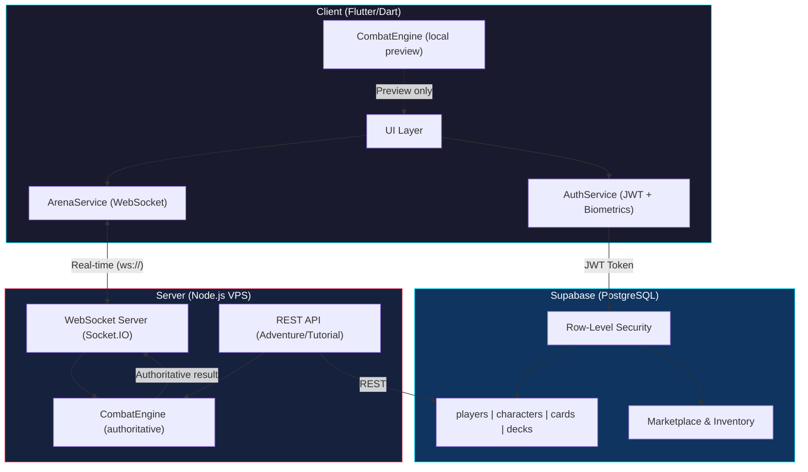

# Automation & AI Engineering Portfolio

> **Author:** Christian Perez — Full-Stack Engineer & Automation Specialist  
> **Live Product:** [playkofight.com](https://playkofight.com/)  
> **Gameplay Demo:** [Watch on TikTok](https://www.tiktok.com/@castellstudios/video/7631270483593350421?lang=es-419)  


---

## Table of Contents
- [Overview](#overview)
- [Project 1: KOSPRITE — Asset Processing Pipeline](#project-1-kosprite--asset-processing-pipeline)
- [Project 2: KOFIGHT — Backend Logic & Real-Time Automation](#project-2-kofight--backend-logic--real-time-automation)
- [Architecture Diagram](#architecture-diagram)
- [Featured Code Samples](#featured-code-samples)
- [Security & Compliance Approach](#security--compliance-approach)
- [Contact](#contact)

---

## Overview

This portfolio showcases two production systems I designed and built end-to-end, demonstrating expertise in **process automation**, **real-time data synchronization**, **rule-engine design**, and **secure backend architecture**.

Both projects are live and serving real users.

---

## Project 1: KOSPRITE — Asset Processing Pipeline

| | |
|---|---|
| **Business Problem** | Manual processing of 200+ game assets (cropping, compression, routing) consumed ~5 hours/week and was error-prone, creating bottlenecks in the development pipeline. |
| **Tools & Platforms** | JavaScript, Node.js, File System API, Sharp (image processing) |
| **My Role** | Sole engineer. Designed, built, and deployed the full pipeline. |

### Workflow Architecture

```
┌──────────────┐    ┌─────────────────────┐    ┌──────────────────┐
│  Raw Assets  │───▶│  Ingestion Pipeline │───▶│  Production Dir  │
│  (200+ files)│    │  • Auto-crop        │    │  • Optimized     │
└──────────────┘    │  • Compression      │    │  • Categorized   │
                    │  • Format Validate  │    │  • Deploy-ready  │
                    │  • Error Logging    │    └──────────────────┘
                    └─────────────────────┘
```

### Measurable Outcomes

- **40% reduction in processing time** — from ~5 hours/week to under 3 hours
- **Zero manual errors** — automated validation replaced human visual checks
- **Consistent output quality** — standardized compression and sizing across all assets

---

## Project 2: KOFIGHT — Backend Logic & Real-Time Automation

| | |
|---|---|
| **Business Problem** | Synchronizing complex game states between multiple concurrent players in real-time, while maintaining data integrity, preventing cheating, and ensuring sub-100ms response times. |
| **Tools & Platforms** | Flutter/Dart, Supabase (PostgreSQL), Node.js, Socket.IO (WebSockets), Python |
| **My Role** | Sole architect & engineer. Designed the full-stack architecture, combat engine, real-time infrastructure, marketplace logic, and security layer. |

### Workflow Architecture

```
┌─────────────┐     WebSocket (JWT)      ┌──────────────────┐
│ Player App  │◄────────────────────────▶│  Arena Server    │
│ (Flutter)   │                          │  (Node.js)       │
└──────┬──────┘                          └────────┬─────────┘
       │                                          │
       │  REST API + JWT Auth                     │ Turn Resolution
       │                                          │
       ▼                                          ▼
┌──────────────────┐                    ┌──────────────────┐
│    Supabase      │                    │  CombatEngine    │
│  (PostgreSQL)    │                    │  (Rule Engine)   │
│  • RLS Policies  │                    │  • 44 card rules │
│  • Auth          │                    │  • AI decisions  │
│  • Inventory     │                    │  • State sync    │
│  • Marketplace   │                    └──────────────────┘
└──────────────────┘
```

### Key Engineering Highlights

#### 1. Deterministic Rule Engine ([combat_engine.dart](lib/engine/combat_engine.dart))
- **814-line state machine** that resolves multi-agent combat turns deterministically
- Initiative system sorted by `quickness` → `agility` → random tiebreaker
- 20+ status effects (bleed, stun, vulnerability, shields, poison, evasion) with proper interaction logic
- Same engine runs on **both client and server** — ensuring authoritative server validation while enabling responsive client-side previews
- Built-in **AI decision system** for NPC opponents with adaptive behavior (switches to defensive strategy when HP < 30%)

#### 2. Real-Time Communication ([arena_service.dart](lib/services/arena_service.dart))
- WebSocket-based PvP matchmaking and turn synchronization via Socket.IO
- **Fault-tolerant reconnection**: automatic room rejoin after network drops
- **Heartbeat monitoring**: Ping/Pong every 3 seconds with latency tracking (>200ms triggers warnings)
- 10 separate event streams for granular state management (match found, turn result, emotes, disconnections, etc.)

#### 3. Secure Session Management ([auth_service.dart](lib/services/auth_service.dart))
- Cryptographically secure session tokens via `Random.secure()` (32-character hex)
- **Concurrent session detection**: each login pushes a unique token to the database — if another device logs in, the previous session is invalidated
- Biometric authentication support (fingerprint, Face ID, Windows Hello) via [credential_service.dart](lib/services/credential_service.dart) with encrypted local storage (`flutter_secure_storage`)
- Automatic session timeout: 5 minutes of inactivity triggers signout

#### 4. Automated Code Patching ([fix.py](fix.py))
- Python script that uses **regex-based AST patching** to programmatically modify Dart source files
- Replaces specific UI blocks in production code without manual editing
- Demonstrates developer-tool automation: building internal tools to accelerate team velocity

### Measurable Outcomes

- **Sub-100ms latency** for real-time PvP state synchronization
- **100% server-authoritative** combat resolution — eliminates client-side cheating
- **Automated marketplace** with supply-tracking, gacha probability engine, and atomic transactions
- **Zero credential exposure** — encrypted storage + biometric auth on mobile

---

## Architecture Diagram



---

## Featured Code Samples

| File | Lines | What It Demonstrates |
|---|---|---|
| [`combat_engine.dart`](lib/engine/combat_engine.dart) | 814 | Deterministic rule engine, AI logic, state serialization |
| [`arena_service.dart`](lib/services/arena_service.dart) | 274 | WebSocket management, reconnection, heartbeat monitoring |
| [`auth_service.dart`](lib/services/auth_service.dart) | 122 | Secure token generation, concurrent session prevention |
| [`credential_service.dart`](lib/services/credential_service.dart) | 119 | Encrypted credential storage, biometric authentication |
| [`fix.py`](fix.py) | 314 | Regex-based automated code patching |

---

## Security & Compliance Approach

These patterns are directly transferable to regulated environments (HIPAA, SOC 2):

| Principle | Implementation |
|---|---|
| **Data Isolation** | PostgreSQL Row-Level Security (RLS) — each user can only access their own data |
| **Encryption at Rest** | Credentials stored via `flutter_secure_storage` with AES encryption |
| **Encryption in Transit** | JWT-authenticated WebSocket and REST connections |
| **Session Integrity** | Unique session tokens prevent concurrent unauthorized access |
| **Audit-Ready Architecture** | Server-authoritative design creates an immutable log of every state change |
| **Automated Validation** | Pipeline validates all data before database insertion — no manual entry |

---

## Contact

- **GitHub:** [https://github.com/christianprogramer09-lab/automation-portfolio-christian.git)
- **Website:** (https://playkofight.com/)
- **Email:** *(christian.programer09@gmail.com)*

